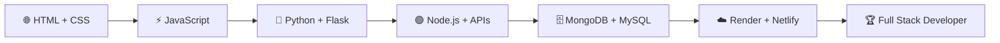

<p align="center">
  
</p>

<p align="center">
  
</p>

<p align="center">
  
</p>

<p align="center">
  <a href="https://github.com/angelcamayojm-wq">
    
  </a>
  <a href="https://github.com/angelcamayojm-wq?tab=followers">
    
  </a>
  <a href="https://github.com/angelcamayojm-wq?tab=repositories">
    
  </a>
  <a href="mailto:angel.camayojm@gmail.com">
    
  </a>
</p>


<!-- ============================ TERMINAL ============================ -->

<p align="center">
  
</p>

```bash
$ whoami
angel-rivera 👨‍💻

$ cat rol.txt
Software Developer in progress 🚀

$ cat estudio.txt
Análisis y Desarrollo de Software 🎓

$ cat objetivo.txt
Full Stack Developer 🏆

$ echo $FILOSOFIA
Romper 💥 → Arreglar 🔧 → Aprender 📚 → Repetir 🔁

$ status --energia
🔥🔥🔥 100% cargada
```


<!-- ============================ SOBRE MI ============================ -->

<p align="center">
  
</p>

<p align="center">
  Soy estudiante de <b>Análisis y Desarrollo de Software</b> y me estoy formando para ser <b>Full Stack Developer</b>.<br>
  Me gusta construir cosas que funcionan de verdad: desde una página web hasta una <b>API con base de datos</b>, y ponerlas en línea para que cualquiera las use. 🌎
</p>

<table align="center">
  <tr>
    <td align="center" width="200">🎓<br><b>Estudio</b><br><sub>Análisis y Desarrollo<br>de Software</sub></td>
    <td align="center" width="200">🎯<br><b>Objetivo</b><br><sub>Full Stack<br>Developer</sub></td>
    <td align="center" width="200">🔥<br><b>Enfoque</b><br><sub>Práctica<br>constante</sub></td>
    <td align="center" width="200">🧠<br><b>Filosofía</b><br><sub>Romper, arreglar<br>y aprender</sub></td>
  </tr>
</table>

```javascript
const angel = {
  rol: "Software Developer in progress",
  frontend: ["HTML", "CSS", "JavaScript"],
  backend: ["Python", "Flask", "Node.js"],
  basesDeDatos: ["MongoDB", "MySQL"],
  despliegue: ["Render", "Netlify"],
  herramientas: ["Git", "GitHub", "VS Code", "APIs"],
  aprendiendo: ["APIs REST", "GitHub Actions", "Arquitectura backend"],
  objetivo: "Full Stack Developer",
  energia: "🔥🔥🔥"
};
```

<p align="center">
  
  
  
</p>

<p align="center">
  
</p>


<!-- ============================ TECH STACK ============================ -->

<p align="center">
  
</p>

<h3 align="center">🌐 Frontend</h3>

<p align="center">
  
</p>

<h3 align="center">⚙️ Backend y lenguajes</h3>

<p align="center">
  
</p>

<h3 align="center">🗄️ Bases de datos</h3>

<p align="center">
  
</p>

<h3 align="center">🧰 Herramientas y despliegue</h3>

<p align="center">
  
  
</p>

<h3 align="center">🔌 Conceptos que domino y practico</h3>

<p align="center">
  
  
  
  
</p>


<!-- ============================ APRENDIENDO ============================ -->

<p align="center">
  
</p>

<table align="center">
  <tr>
    <td align="center" width="230">🐍<br><b>Python + Flask</b><br><sub>Backend y rutas web</sub></td>
    <td align="center" width="230">🟢<br><b>Node.js</b><br><sub>Servidores y APIs</sub></td>
    <td align="center" width="230">🗄️<br><b>MongoDB + MySQL</b><br><sub>NoSQL y relacional</sub></td>
  </tr>
  <tr>
    <td align="center" width="230">🔌<br><b>APIs REST</b><br><sub>Consumir y crear</sub></td>
    <td align="center" width="230">☁️<br><b>Render + Netlify</b><br><sub>Deploy en la nube</sub></td>
    <td align="center" width="230">🔀<br><b>Git + GitHub</b><br><sub>Branches, PRs, Issues, Actions</sub></td>
  </tr>
</table>


<!-- ============================ PROGRESO ============================ -->

<p align="center">
  
</p>

| Nivel | Tema                                | Estado             |
| ----- | ----------------------------------- | ------------------ |
| 🟢    | HTML, CSS, JavaScript               | ⚡ En práctica      |
| 🟡    | Funciones, Arrays, Objetos, DOM     | 🔥 Mejorando       |
| 🐍    | Python y Flask                      | 🚀 En proceso      |
| 🟣    | Node.js, APIs, JSON                 | 🚀 En proceso      |
| 🗄️    | MongoDB y MySQL                     | 📚 Aprendiendo     |
| ☁️    | Despliegue con Render y Netlify     | 🎯 Practicando     |
| 🔵    | Git, Branches, PRs, Issues, Actions | 🎯 Practicando     |
| 🏆    | Full Stack Developer                | 🏗️ En construcción |

<h3 align="center">🗺️ Mi ruta hacia Full Stack</h3>




<!-- ============================ PRINCIPIOS ============================ -->

<p align="center">
  
</p>

<table align="center">
  <tr>
    <td align="center" width="25%">🔧<br><b>Practicar todos los días</b><br><sub>Código pequeño,<br>constancia grande</sub></td>
    <td align="center" width="25%">🐛<br><b>Romper y arreglar</b><br><sub>Los errores son<br>mis mejores profesores</sub></td>
    <td align="center" width="25%">🤝<br><b>Compartir lo aprendido</b><br><sub>Todo lo que subo<br>le puede servir a alguien</sub></td>
    <td align="center" width="25%">🚀<br><b>Nunca dejar de crecer</b><br><sub>Hoy mejor<br>que ayer</sub></td>
  </tr>
</table>


<!-- ============================ ESTADISTICAS ============================ -->

<p align="center">
  
</p>

<p align="center">
  
  
</p>

<p align="center">
  
  
</p>

<p align="center">
  
</p>

<h3 align="center">🏆 Trofeos</h3>

<p align="center">
  
</p>


<!-- ============================ SNAKE ============================ -->

<p align="center">
  
</p>

<p align="center">
  
</p>


<!-- ============================ REPOSITORIOS ============================ -->

<p align="center">
  
</p>

<p align="center">
  Aquí voy dejando todo lo que construyo mientras aprendo: <b>prácticas, ejercicios y proyectos en evolución</b>. 🧪<br>
  Cada commit es un paso más hacia Full Stack. 👣
</p>

<p align="center">
  <a href="https://github.com/angelcamayojm-wq?tab=repositories">
    
  </a>
</p>


<!-- ============================ CONTACTO ============================ -->

<p align="center">
  
</p>

<p align="center">
  ¿Tienes una idea, un proyecto o quieres aprender en equipo? 💡<br>
  <b>Escríbeme, con gusto conversamos.</b> 🤝
</p>

<p align="center">
  <a href="mailto:angel.camayojm@gmail.com">
    
  </a>
  <a href="https://github.com/angelcamayojm-wq">
    
  </a>
</p>

<p align="center">
  <b>Gracias por visitar mi perfil 🚀</b><br>
  <i>Siempre aprendiendo, siempre construyendo. 💙</i>
</p>

<p align="center">
  
</p>
