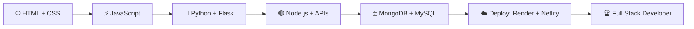

# 👋 Hola, soy Angel Rivera

<p align="center">
  
</p>

<p align="center">
  
</p>

<p align="center">
  
</p>

<p align="center">
  <a href="https://github.com/angelcamayojm-wq">
    
  </a>
  <a href="https://github.com/angelcamayojm-wq?tab=followers">
    
  </a>
  <a href="https://github.com/angelcamayojm-wq?tab=repositories">
    
  </a>
  <a href="mailto:angel.camayojm@gmail.com">
    
  </a>
</p>

---

## 👨‍💻 Sobre mí

<p align="center">
  
  
</p>

Soy estudiante de **Análisis y Desarrollo de Software** y me estoy formando para ser **Full Stack Developer**. Me gusta construir cosas que funcionan de verdad: desde una página web hasta una API con base de datos, y ponerlas en línea para que cualquiera las use. Mi forma de aprender es simple: **romper, arreglar, aprender y repetir.**

```javascript
const angel = {
  rol: "Software Developer in progress",
  estudio: "Análisis y Desarrollo de Software",
  frontend: ["HTML", "CSS", "JavaScript"],
  backend: ["Python", "Flask", "Node.js"],
  basesDeDatos: ["MongoDB", "MySQL"],
  despliegue: ["Render", "Netlify"],
  herramientas: ["Git", "GitHub", "VS Code", "APIs"],
  aprendiendo: ["APIs REST", "GitHub Actions", "Arquitectura backend"],
  objetivo: "Full Stack Developer",
  energia: "🔥🔥🔥"
};
```

<p align="center">
  
  
  
</p>

---

## 🥷 Mi camino ninja

<p align="center">
  
  
</p>

<p align="center">
  <i>Cada bug es un enemigo nuevo, cada solución es un jutsu más en mi arsenal. 🔥</i>
</p>

---

## 🛠️ Tech Stack

### 🌐 Frontend

<p align="center">
  
</p>

### ⚙️ Backend y lenguajes

<p align="center">
  
</p>

### 🗄️ Bases de datos

<p align="center">
  
</p>

### 🧰 Herramientas y despliegue

<p align="center">
  
  
</p>

<p align="center">
  
  
  
</p>

<p align="center">
  
  
  
  
</p>

---

## 🔥 Lo que estoy construyendo y aprendiendo

<p align="center">
  
</p>

- 🐍 Desarrollo backend con **Python y Flask**
- 🟢 Servidores y APIs con **Node.js**
- 🍃 Bases de datos NoSQL con **MongoDB** y relacionales con **MySQL**
- 🌐 Consumo y creación de **APIs REST**
- ☁️ Despliegue de aplicaciones en **Render** y **Netlify**
- 🔀 Flujo de trabajo profesional con **Git, Branches, Pull Requests, Issues y Actions**

---

## 📈 Mi progreso

| Nivel | Tema                                    | Estado             |
| ----- | --------------------------------------- | ------------------ |
| 🟢    | HTML, CSS, JavaScript                   | ⚡ En práctica      |
| 🟡    | Funciones, Arrays, Objetos, DOM         | 🔥 Mejorando       |
| 🐍    | Python y Flask                          | 🚀 En proceso      |
| 🟣    | Node.js, APIs, JSON                     | 🚀 En proceso      |
| 🗄️    | MongoDB y MySQL                         | 📚 Aprendiendo     |
| ☁️    | Despliegue con Render y Netlify         | 🎯 Practicando     |
| 🔵    | Git, Branches, PRs, Issues, Actions     | 🎯 Practicando     |
| 🏆    | Full Stack Developer                    | 🏗️ En construcción |

---

## 📚 Mi ruta hacia Full Stack



---

## 🧭 Mis principios

<table align="center">
  <tr>
    <td align="center" width="25%">🔧<br><b>Practicar todos los días</b><br><sub>Código pequeño, constancia grande</sub></td>
    <td align="center" width="25%">🐛<br><b>Romper y arreglar</b><br><sub>Los errores son mis mejores profesores</sub></td>
    <td align="center" width="25%">🤝<br><b>Compartir lo aprendido</b><br><sub>Todo lo que subo, ayuda a alguien más</sub></td>
    <td align="center" width="25%">🚀<br><b>Nunca dejar de crecer</b><br><sub>Hoy mejor que ayer</sub></td>
  </tr>
</table>

---

## 📊 Estadísticas

<p align="center">
  
  
</p>

<p align="center">
  
  
</p>

<p align="center">
  
</p>

---

## 🐍 Snake de contribuciones

<p align="center">
  
</p>

---

## 📂 Mis repositorios

<p align="center">
  
</p>

<p align="center">
  Aquí voy dejando todo lo que construyo mientras aprendo: prácticas, ejercicios y proyectos en evolución.
  <br><br>
  <a href="https://github.com/angelcamayojm-wq?tab=repositories">
    
  </a>
</p>

---

## 📫 Conectemos

<p align="center">
  ¿Tienes una idea, una oportunidad o quieres aprender juntos? Escríbeme.
</p>

<p align="center">
  <a href="mailto:angel.camayojm@gmail.com">
    
  </a>
  <a href="https://github.com/angelcamayojm-wq">
    
  </a>
</p>

<p align="center">
  
</p>

<p align="center">
  <b>Gracias por visitar mi perfil 🚀</b>
  <br>
  <i>Siempre aprendiendo, siempre construyendo.</i>
</p>

<p align="center">
  
</p>
